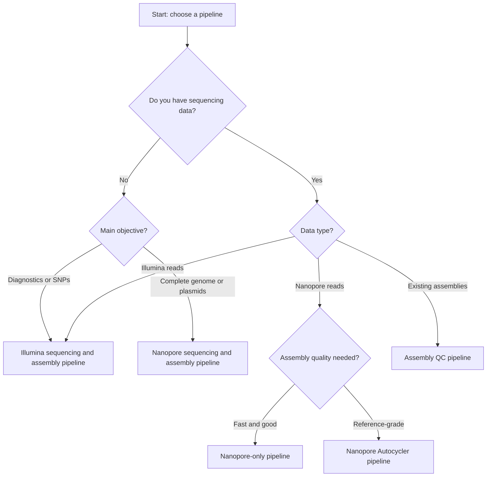

## Why this comparison matters in plant pathology

High‑throughput sequencing has become a **routine tool** in plant pathogen research, diagnostics, and surveillance. A lot of labs are now asking: **should we use Illumina or Nanopore sequencing for our plant pathogen projects?** The answer isn’t one‑size‑fits‑all—it depends on your specific goals, resources, and the biology of your pathogens.
For bacterial plant pathogens such as _Pseudomonas_, _Xanthomonas_, _Ralstonia_, _Erwinia_, and related taxa, the choice between **Illumina short‑read sequencing** and **Oxford Nanopore long‑read sequencing** has **direct consequences** for:

- turnaround time
- assembly quality
- plasmid detection
- downstream phylogenetics and diagnostics

This post provides a **practical, lab‑oriented comparison** of Illumina and Nanopore sequencing, grounded in **real Snakemake workflows** used for plant‑pathogen genomics.

---

## The technologies in one sentence

- **Illumina** → short, highly accurate reads; ideal for SNPs, surveillance, and diagnostics
- **Nanopore** → long, real‑time reads; ideal for complete genomes and plasmids

---

## Read characteristics and assembly implications

### Illumina (short reads)

- Typical reads: 2×150 bp
- Very low per‑base error rate
- Assemblies are accurate but often **fragmented**

Best suited for:

- routine diagnostics
- SNP‑based phylogenetics
- cgMLST / MLST
- high‑throughput surveillance

---

### Nanopore (long reads)

- Read lengths: 5 kb – 100 kb+
- Higher raw error rate (improving rapidly)
- Assemblies often **closed**

Best suited for:

- reference genome generation
- plasmid and genomic island detection
- structural variation
- rapid outbreak investigation

---

## Diagnostics vs discovery

| Use case            | Illumina | Nanopore |
| ------------------- | -------- | -------- |
| Routine diagnostics | ✅       | ⚠️       |
| SNP resolution      | ✅       | ⚠️       |
| Complete genomes    | ❌       | ✅       |
| Plasmid detection   | ❌       | ✅       |
| Turnaround time     | ⏳       | ⚡       |

In practice, **both technologies complement each other** rather than compete.

---

## Snakemake workflows used in practice

The real impact of sequencing technology is best understood through the **analysis workflows** that follow.

---

## Illumina bacterial assembly + QC workflow

Designed for **high‑throughput Illumina paired‑end data**, this pipeline performs:

- read QC and trimming
- de novo assembly
- assembly QC (QUAST, BUSCO, CheckM2)
- taxonomic validation
- unified HTML/PDF reporting

📦 Repository  
<https://gitlab.ilvo.be/genomics/wgs/illumina-bacterial-assembly-snakemake>

---

## Nanopore‑only bacterial assembly workflow

Optimized for **Oxford Nanopore R10.4.1 long‑read data**, focusing on:

- long‑read filtering
- de novo assembly
- polishing and QC
- reference‑grade bacterial genomes

📦 Repository  
<https://gitlab.ilvo.be/stevebaeyen/nanopore_only_snakemake>

---

## Nanopore Autocycler consensus workflow

For **maximum assembly quality**, this workflow integrates **multiple assemblers** through Autocycler and Snakemake.

Key features:

- read subsampling
- Flye / Canu / Plassembler consensus
- conflict resolution
- publication‑quality genomes

📦 Repository  
<https://gitlab.ilvo.be/stevebaeyen/nanopore_autocycler_snakemake>

---

## Assembly QC‑only workflow (technology‑agnostic)

Used when assemblies already exist (Illumina, Nanopore, or hybrid).

Includes:

- QUAST
- BUSCO
- CheckM2
- ANI‑based taxonomic checks
- Excel + HTML/PDF summaries

📦 Repository  
<https://gitlab.ilvo.be/stevebaeyen/bacterial-assembly-qc-snakemake>

---

## Decision tree: which pipeline should I use?

